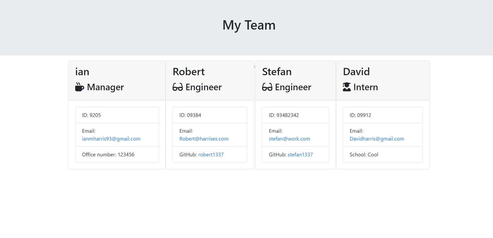

 Project Name
> Template-maker

## Table of contents
* [General info](#general-info)
* [Screenshots](#screenshots)
* [Setup](#setup)
* [Status](#status)
* [Contact](#contact)

## General info
This is a program I designed  using javascript that prompts a user with various questions concerning who is on their workplace team, then generates an HTML page based on those responses.
## Screenshots

## Setup
This program runs in node. The user needs to install the inquirer package.

## Code Examples
Show examples of usage:
// function generateHtml() {

    const html = render(employees);
   
    if (!fs.existsSync(OUTPUT_DIR)){
        fs.mkdirSync(OUTPUT_DIR);
    }
    
    fs.writeFile(outputPath, html, err => {
        if (err) {
            return console.log(err)
        } 
        console.log("success writing file")

    });

}
//

This is a block of code that generates HTML after the user answers the prompts. This code is essentially saying "if there is no directory called 'OUTPUT', then make one, and once thats done, generate our HTML to that directory. 

## Status
Project is in progress. Feel free to email me with any suggestions or to report any bugs: ianmharris93@gmail.com

## Contact
Created by Ian Harris(https://github.com/iannm93) - ianmharris93@gmail.com - feel free to contact me!
